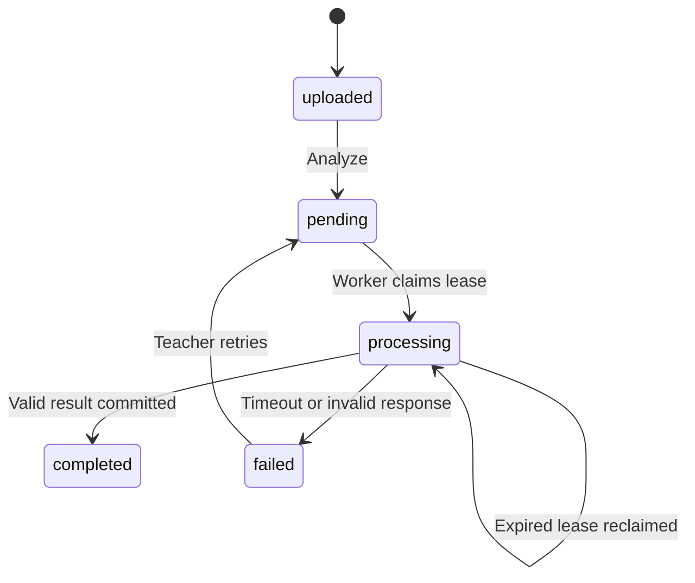

# Hợp đồng BE ↔ AI

`app/integrations/ai_schema.py` là nguồn schema chung. AI thật cần xác nhận contract này trước khi đổi `AI_MODE=http`. Không có callback endpoint; BE worker chờ HTTP response trong process nền. HTTP 202 từ AI chưa được hỗ trợ: nếu AI thật tự enqueue và trả job_id, cần bổ sung adapter polling/callback riêng.

## Batch: POST /v1/analyze/video

BE gửi tới `AI_BASE_URL`:

```http
Authorization: Bearer <AI_API_KEY>
Idempotency-Key: <analysis_job_id>
Content-Type: application/json
```

```json
{
  "recording_id": "6d82b5fd-8efc-4e24-8766-03f18acf0b1b",
  "video_url": "https://api.cloudinary.com/...signed-download...",
  "duration": 120.0
}
```

`video_url` do BE sinh từ metadata Cloudinary, client không được cung cấp URL nguồn tùy ý. URL tồn tại lâu hơn timeout AI 120 giây. AI cần tải ngay và không ghi URL có chữ ký vào log.

AI trả HTTP 200, **body trực tiếp** theo schema dưới, không bọc envelope BE:

```json
{
  "sample_counts": {"happy": 45, "neutral": 40, "sad": 15},
  "timeline": [
    {"timestamp": 0.0, "emotion": "happy", "confidence": 0.92, "student_id": null, "mock": false},
    {"timestamp": 1.0, "emotion": "neutral", "confidence": 0.88, "student_id": null, "mock": false}
  ],
  "summary": "100 classified samples.",
  "mock": false
}
```

- `sample_counts` là số mẫu **nguyên**, không âm, tối đa 1.000.000.000 cho mỗi cảm xúc. Đây không phải phần trăm. Phần trăm chỉ do BE tính.
- Emotion: `happy`, `neutral`, `sad`, `angry`, `surprised`, `fearful`, `disgusted`.
- Timeline có thể là tập con các mẫu để giảm kích thước; số điểm mỗi emotion không được vượt `sample_counts[emotion]`.
- `timestamp` là giây trong recording: `0 <= timestamp <= duration`.
- `confidence` thuộc [0,1], không nhận NaN/Infinity.
- `student_id` không bắt buộc. AI không nên tự đoán danh tính từ khuôn mặt; chỉ trả ID khi pipeline có ánh xạ rõ ràng và ID thuộc participant của meeting. Backend kiểm tra membership khi lưu batch.
- `summary` tối đa 4.000 ký tự. Timeline tối đa 20.000 điểm. HTTP response tối đa 8 MiB mặc định.
- Không phát hiện dữ liệu: `sample_counts={}`, `timeline=[]`, summary mô tả lý do.
- Lỗi HTTP, timeout, schema sai, timestamp ngoài video hoặc student ngoài phòng → job failed. Error công khai không chứa body/credential AI.

## Realtime: POST /v1/analyze/frame

BE gửi multipart với **một field `frame`**, filename `frame`, MIME `image/jpeg` hoặc `image/png`; header `Authorization: Bearer <AI_API_KEY>`.

```json
{"emotion": "neutral", "confidence": 0.87, "mock": false}
```

AI không cần trả student_id/meeting_id/timestamp; backend gắn từ request được xác thực. Timeout mặc định 10 giây. Frame chỉ giữ trong RAM và không được lưu SQL/Cloudinary; SQL lưu kết quả.

## Mock và adapter

`MockAIClient` chọn pseudo-random bằng seed recording_id hoặc hash frame để test có thể tái lập. Cùng một frame có cùng kết quả mock; đây là chủ ý để test ổn định. Mock batch tạo 20 điểm nằm trong duration; mọi kết quả có `mock=true` và summary được đánh dấu. Mock không đọc video, không suy luận AI.

`create_app(settings, session_factory, ai, storage)` hỗ trợ thay adapter trong test. `HttpAIClient` hỗ trợ httpx transport cho contract test. Production config không cho `AI_MODE=mock`.

## Trạng thái và retry



Không tự retry lỗi AI thông thường để tránh lặp chi phí ngoài ý muốn; teacher có thể gọi Analyze lại sau trạng thái failed. Crash/restart worker được khôi phục bằng lease. Cùng job_id được giữ qua retry: AI cần lưu thành công theo idempotency key và cho phép thử lại khi lần trước thất bại. Kết quả completed được coi là bất biến qua API Analyze hiện tại.
