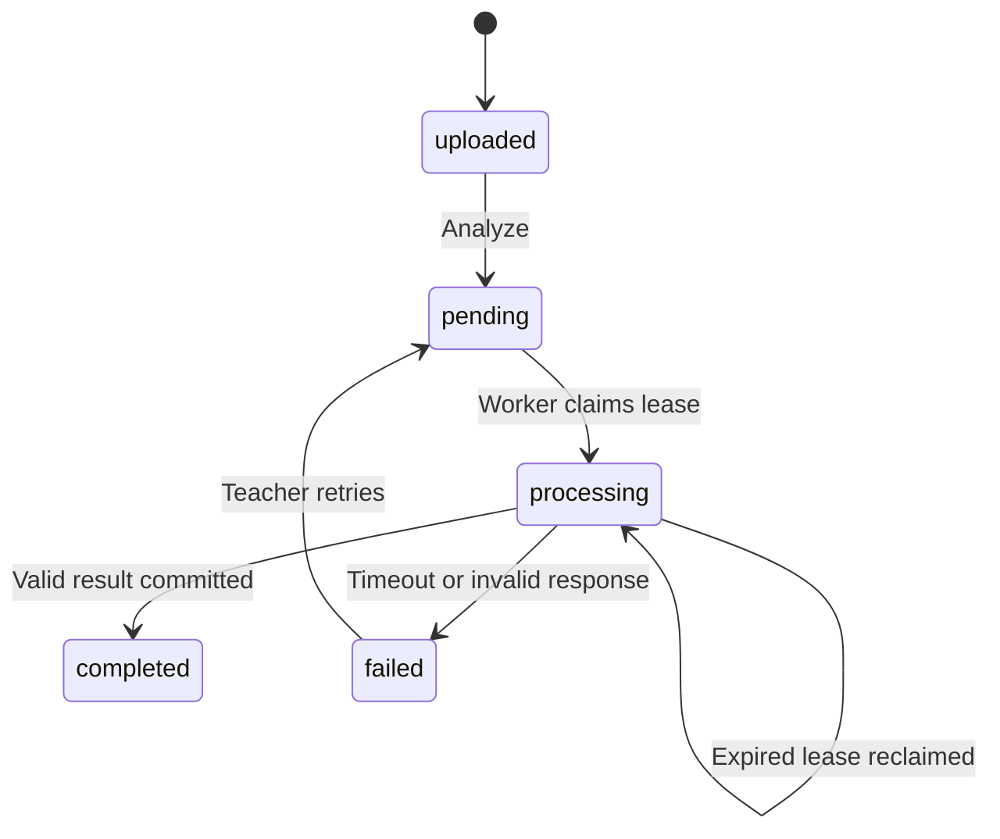

# Hợp đồng BE ↔ AI

`app/integrations/ai_schema.py` là nguồn schema chung. Mặc định `AI_MODE=http`; đặt rõ `AI_MODE=mock` chỉ khi test. Không có callback endpoint; BE worker chờ HTTP response trong process nền. HTTP 202 từ AI chưa được hỗ trợ: nếu AI thật tự enqueue và trả job_id, cần bổ sung adapter polling/callback riêng.

## Batch: POST /v1/analyze/video

BE gửi tới `AI_BASE_URL`:

```http
Authorization: Bearer <AI_API_KEY>
Idempotency-Key: <analysis_job_id>
Content-Type: application/json
```

```json
{
  "recording_id": "6d82b5fd-8efc-4e24-8766-03f18acf0b1b",
  "video_url": "https://api.cloudinary.com/...signed-download...",
  "duration": 120.0
}
```

`video_url` do BE sinh từ metadata Cloudinary, client không được cung cấp URL nguồn tùy ý. URL tồn tại lâu hơn timeout AI 120 giây. AI cần tải ngay và không ghi URL có chữ ký vào log.

AI trả HTTP 200, **body trực tiếp** theo schema dưới, không bọc envelope BE:

```json
{
  "sample_counts": {"happy": 45, "neutral": 40, "sad": 15},
  "timeline": [
    {"timestamp": 0.0, "emotion": "happy", "confidence": 0.92, "student_id": null, "mock": false},
    {"timestamp": 1.0, "emotion": "neutral", "confidence": 0.88, "student_id": null, "mock": false}
  ],
  "summary": "100 classified samples.",
  "mock": false
}
```

- `sample_counts` là số mẫu **nguyên**, không âm, tối đa 1.000.000.000 cho mỗi cảm xúc. Đây không phải phần trăm. Phần trăm chỉ do BE tính.
- Emotion: `happy`, `neutral`, `sad`, `angry`, `surprised`, `fearful`, `disgusted`.
- Timeline có thể là tập con các mẫu để giảm kích thước; số điểm mỗi emotion không được vượt `sample_counts[emotion]`.
- `timestamp` là giây trong recording: `0 <= timestamp <= duration`.
- `confidence` thuộc [0,1], không nhận NaN/Infinity.
- `student_id` không bắt buộc. AI không nên tự đoán danh tính từ khuôn mặt; chỉ trả ID khi pipeline có ánh xạ rõ ràng và ID thuộc participant của meeting. Backend kiểm tra membership khi lưu batch.
- `summary` tối đa 4.000 ký tự. Timeline tối đa 20.000 điểm. HTTP response tối đa 8 MiB mặc định.
- Không phát hiện dữ liệu: `sample_counts={}`, `timeline=[]`, summary mô tả lý do.
- Lỗi HTTP, timeout, schema sai, timestamp ngoài video hoặc student ngoài phòng → job failed. Error công khai không chứa body/credential AI.

## Realtime: POST /v1/analyze/frame

BE gửi multipart gồm file `frame` (JPEG/PNG), field `frame_id` và field `timestamp` (ISO 8601 có timezone); header `Authorization: Bearer <AI_API_KEY>`. AI chịu trách nhiệm detect/crop/resize/normalize. BE chỉ kiểm tra định dạng, kích thước byte và pixel của ảnh.

```json
{
  "frame_id": "frame-42", "timestamp": "2026-09-25T10:00:00Z",
  "face_detected": true, "face_id": "face-1",
  "emotion": "neutral", "confidence": 0.7,
  "probabilities": {"happy": 0.05, "neutral": 0.7, "sad": 0.05, "angry": 0.05,
                    "surprised": 0.05, "fearful": 0.05, "disgusted": 0.05},
  "failure_reason": null, "mock": false
}
```

AI phải echo đúng `frame_id` và `timestamp`; BE từ chối kết quả không khớp. Student/meeting lấy từ quyền của request, không lấy từ AI. Bảy xác suất thuộc [0,1], tổng bằng 1 (sai số 0.001); emotion là lớp có xác suất cao nhất và confidence bằng xác suất của lớp đó.

Không thấy mặt vẫn trả HTTP 200 với `face_detected=false`, `face_id=null`, `emotion="fail_detection"`, `confidence=0`, đủ 7 xác suất bằng 0 và `failure_reason="no_face"`. Không dùng xác suất đều nhau vì điều đó có thể bị hiểu là một dự đoán thật.

HTTP lỗi, timeout, schema sai hoặc metadata không khớp được BE lưu thành `fail_detection`, `failure_reason="ai_error"`. `face_detected=false` trong trường hợp này nghĩa là không có kết quả phát hiện mặt hợp lệ, không khẳng định học viên đã rời camera. Timeout mặc định 10 giây. Frame chỉ giữ trong RAM; MongoDB/SQL lưu kết quả và metadata, không lưu ảnh.

BE nhận mặc định 3 FPS, cấu hình 2–5 FPS bằng `FRAME_INTERVAL_SECONDS=0.5..0.2`. Chat log chỉ phát khi trạng thái/lý do lỗi thay đổi hoặc sau 90 giây tính từ log gần nhất. Mọi kết quả đều được lưu để báo cáo không bị lệch phân bố do lọc chat log. Kết quả trả chậm hơn frame đã xử lý vẫn được lưu nhưng không làm lùi trạng thái trực tiếp.

## Mock và adapter

`MockAIClient` chọn pseudo-random bằng seed recording_id hoặc hash frame để test có thể tái lập. Cùng một frame có cùng kết quả mock; đây là chủ ý để test ổn định. Mock batch tạo 20 điểm nằm trong duration; mọi kết quả có `mock=true` và summary được đánh dấu. Mock không đọc video, không suy luận AI.

`create_app(settings, session_factory, ai, storage)` hỗ trợ thay adapter trong test. `HttpAIClient` hỗ trợ httpx transport cho contract test. Production config không cho `AI_MODE=mock`.

## Trạng thái và retry



Không tự retry lỗi AI thông thường để tránh lặp chi phí ngoài ý muốn; teacher có thể gọi Analyze lại sau trạng thái failed. Crash/restart worker được khôi phục bằng lease. Cùng job_id được giữ qua retry: AI cần lưu thành công theo idempotency key và cho phép thử lại khi lần trước thất bại. Kết quả completed được coi là bất biến qua API Analyze hiện tại.
