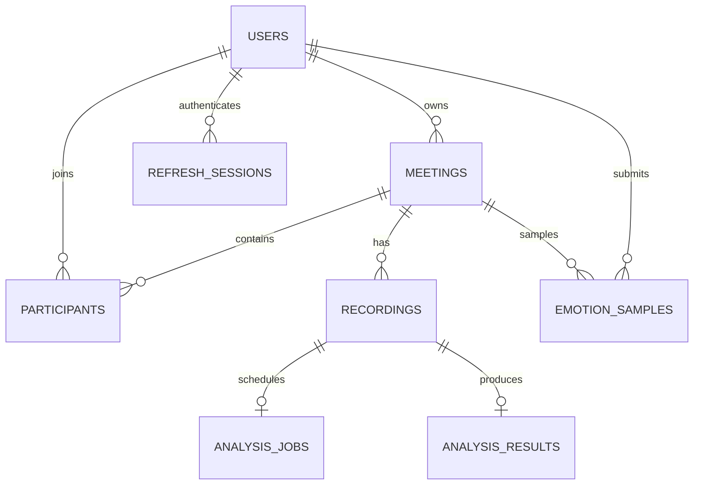

# Kiến trúc và Data Model

## Cấu trúc

```text
face-emotion-backend/
  app/
    main.py                  # App factory, DI adapters, handlers, routes
    worker.py                # Worker SQL bền vững, chạy process riêng
    models.py                # Registry model cho Alembic
    core/
      config.py db.py dependencies.py errors.py limits.py schemas.py security.py
    integrations/
      storage.py             # VideoStorage protocol + CloudinaryStorage
      ai.py                  # AIClient protocol + MockAIClient + HttpAIClient
      ai_schema.py           # Contract AI chung
    modules/
      auth/
      meetings/
      signaling/             # Có ConnectionManager, không có media relay
      recordings/
      analysis/
      emotions/
      reports/               # Read model trên kết quả batch/realtime
  alembic/versions/           # Migration độc lập với model hiện tại
  tests/                     # HTTP, WebSocket, repository race, adapter contract
  docs/
  scripts/create_database.sql scripts/check_sqlserver.py
  pyproject.toml requirements.lock .env.example
```

Trong mỗi module: router nhận/validate request; service kiểm tra nghiệp vụ và transaction; repository truy vấn SQL hoặc connection index; model mô tả lưu trữ. Schema Pydantic nằm cạnh model. Service giữa các module dùng contract của module phụ thuộc để áp dụng cùng chính sách quyền.

## Dependency đã dùng để triển khai

1. BE-01 hoàn thiện `CurrentUser`, `Teacher`, `Student`, `require_role`, User và session factory.
2. BE-02 dùng BE-01, cung cấp `MeetingService.require(..., owner, active, lock)`.
3. BE-03 và BE-04 dùng interface meeting đã hoàn thiện.
4. BE-05 dùng RecordingService, VideoStorage và AIClient contract.
5. BE-06 dùng MeetingService, ConnectionManager và AIClient. FE-04/AI-06 được thay bằng test client/mock trong kiểm thử.
6. BE-07 đọc AnalysisResult/EmotionSample theo contract chung; AI-07 thực cần xác nhận `sample_counts` và semantics timeline.

## Các bảng SQL

ID là UUID do ứng dụng sinh, lưu `VARCHAR(36)`. Thời gian luôn UTC; SQL Server dùng DATETIMEOFFSET, SQLite được adapter chuẩn hóa UTC khi đọc. Email chuẩn hóa chữ thường và có unique constraint. Không có SQL collection; các thực thể dùng bảng quan hệ.

| Bảng | Trường | Constraint / index |
|---|---|---|
| users | id, email, password_hash, full_name, role, created_at | PK id; UNIQUE email; CHECK role teacher/student |
| refresh_sessions | jti, user_id, expires_at, revoked_at | PK jti; FK user; index user_id; không lưu raw token |
| meetings | id, code, teacher_id, status, created_at, ended_at | PK id; UNIQUE code; FK teacher; CHECK status |
| participants | meeting_id, user_id, status, joined_at, left_at | PK kép meeting/user; FK meeting/user; CHECK joined/left |
| recordings | id, meeting_id, cloudinary_url, public_id, format, duration, size_bytes, status, created_at | PK id; UNIQUE public_id; FK meeting; CHECK duration>0, status |
| analysis_jobs | id, recording_id, state, attempts, lease_token, lease_until, error_message, created_at, updated_at | PK id; UNIQUE recording_id; FK recording; index state/lease_until |
| analysis_results | recording_id, result, completed_at | PK/FK recording_id; result JSON theo BatchResult |
| emotion_samples | id, meeting_id, student_id, timestamp, emotion, confidence, mock | PK id; FK meeting/user; index meeting+timestamp, student |

Participant giữ lần join/leave gần nhất, không phải nhật ký toàn bộ các lần reconnect. Số participant ở API bao gồm cả người đã rời. Lịch sử điểm cảm xúc vẫn tham chiếu user/meeting.

## Quan hệ



## Quyền

| Hành vi | Điều kiện |
|---|---|
| Tạo meeting | Teacher |
| Đọc meeting | Owner hoặc đã có participant record |
| Join | Meeting ongoing; student hoặc teacher sở hữu |
| Start/end | Teacher sở hữu |
| Signaling | Access JWT còn hạn + participant joined + ongoing |
| Upload/read recording, analyze/status/report/playback | Teacher sở hữu meeting |
| Gửi frame | Student đã join, meeting ongoing |
| Nhận cảm xúc qua WS | Chỉ socket teacher sở hữu meeting |

`require_role` chỉ là tầng đầu; mọi resource riêng tư đều kiểm tra ownership/membership để tránh truy cập chéo phòng. Client không được truyền `sender_id` hay `student_id` cho frame; server lấy từ JWT.

## Transaction và concurrent requests

- Register dựa trên UNIQUE email và rollback khi trùng, kể cả concurrent registration.
- Refresh token được consume bằng conditional UPDATE: `revoked_at IS NULL` và chưa hết hạn. Chỉ một request thắng; tạo refresh mới trong cùng transaction.
- Meeting lifecycle dùng WITH (UPDLOCK, ROWLOCK) trên SQL Server; student join lại cập nhật record cũ. SQLite phục vụ dev/test, không có đầy đủ row-lock semantics của SQL Server.
- Analyze dùng conditional UPDATE trên recording để chỉ enqueue từ `uploaded/failed`. Một recording có một job. Request lặp trong pending/processing/completed trả trạng thái hiện có.
- Worker claim bằng conditional UPDATE trên job với OUTPUT INSERTED, khóa recording trước job như enqueue/finish để giữ cùng thứ tự khóa, cấp lease_token mới, cập nhật recording processing rồi commit trước khi gọi AI.
- Kết quả + trạng thái completed được commit cùng transaction. Worker hết lease không thể overwrite do token không còn khớp.
- Worker crash khi processing: job đủ điều kiện nhận lại sau lease. AI có thể nhận request nhiều lần; AI thật cần hỗ trợ `Idempotency-Key`.
- Upload remote và SQL không có distributed transaction. Nếu SQL save thất bại hoặc quá duration, backend gọi delete Cloudinary. Crash giữa upload và SQL hoặc cleanup lỗi có thể để lại orphan asset; cần đối soát theo public_id khi vận hành.
- API sync dùng threadpool FastAPI; đường WS/frame tạo session ngắn trong worker thread. Không chia sẻ Session giữa request hay giữa các job.

## Report semantics

`distribution[e] = sample_counts[e] / tổng sample_counts * 100`, làm tròn 4 số lẻ. Có thể lệch rất nhỏ khỏi 100 do làm tròn. Không trung bình cộng phần trăm giữa các recording khác số mẫu.

`source=auto`: nếu có ít nhất một batch hoàn thành thì chọn batch; nếu chưa có thì chọn realtime. Không cộng batch với realtime vì có thể là cùng sự kiện. `source=realtime` luôn trả mẫu live. Batch chưa hoàn thành được phản ánh bằng `recording_statuses`; `status=partial` khi một số recording chưa completed.

Batch timeline dùng giây tính từ đầu **từng recording**, kèm recording_id. Không suy ra một trục thời gian chung của meeting vì metadata hiện không có thời điểm bắt đầu quay. Realtime timeline dùng timestamp chụp do FE gửi và được chuẩn hóa UTC khi lưu; received_at do BE gắn. Pagination chỉ tác động timeline; distribution và sample_count vẫn tính trên toàn bộ nguồn đã chọn. `fail_detection` có trong timeline nhưng không được tính như một trong 7 lớp cảm xúc.

## Luồng phòng học một giáo viên, một học viên

`Meeting.mode` là realtime/after_session, độc lập với lifecycle scheduled/ongoing/ended. Student slot được gán bằng MongoDB conditional update hoặc SQL compare-and-swap; không đổi học viên sau khi leave. Lock theo meeting trong API process đồng bộ thao tác join/end/leave với việc lưu frame. MongoSession chỉ ghi các trường đã thay đổi để không ghi đè trạng thái do conditional update cập nhật. MongoDB adapter không cung cấp transaction nhiều document; worker có bước phục hồi recording after_session đã lưu nhưng chưa có job.

Socket index vừa theo phòng vừa theo user. Khi thay socket, index được đổi trước khi đóng socket cũ; mọi send kiểm tra connection hiện tại, cleanup cũ không xóa connection mới. Transport disconnect chỉ cập nhật presence; LEAVE chủ động mới đổi membership. API vẫn phải chạy một process.

WebSocket FRAME và REST frame dùng chung service, limiter và semaphore AI. Frame xử lý bằng task có giới hạn để không chặn signaling. Lưu tất cả kết quả; cờ logged chỉ bật khi trạng thái/lý do lỗi đổi hoặc đã qua 90 giây từ log gần nhất, theo đồng hồ BE. Kết quả đến trễ vẫn được lưu nhưng không đẩy lùi trạng thái trực tiếp. Log là dữ liệu bền vững; WS push là best effort.

Tài liệu lưu metadata trong collection/table materials; file nằm trên Cloudinary raw authenticated. Owner upload, participant đọc metadata và lấy signed download URL. Video after_session dùng worker phân tích hiện có, tự enqueue sau upload. Lịch sử teacher chỉ đọc dữ liệu và không kích hoạt lại tác vụ AI.

## Mở rộng

Với lớp đông, bổ sung SFU ở tầng media; signaling hiện chỉ chuyển metadata. Để nhiều API process cần distributed presence/pub-sub và shared limiter. Với báo cáo rất lớn, chuyển timeline JSON sang bảng point riêng để phân trang ngay ở SQL; hiện batch load payload kết quả để tính tổng hợp, tối đa 20.000 điểm mỗi response AI.

Tham khảo API nền tảng: [FastAPI WebSockets](https://fastapi.tiangolo.com/advanced/websockets/) và [SQLAlchemy Session Basics](https://docs.sqlalchemy.org/en/20/orm/session_basics.html). Cấu hình session và connection manager trong project thể hiện các lựa chọn cụ thể của bản triển khai này.

## SQL Server adapter

API, worker và Alembic dùng cùng Settings.sqlalchemy_url. Windows Authentication tạo Trusted_Connection=yes; SQL Authentication tạo UID/PWD có escape ODBC. pyodbc pooling tắt để SQLAlchemy quản lý connection pool. Unicode full_name dùng NVARCHAR(150), error_message dùng NVARCHAR(256), JSON payload dùng NVARCHAR(max). Initial migration giữ nguyên; migration 20260915_unicode đổi các trường Unicode trên SQL Server.

Các conditional UPDATE dùng kết quả OUTPUT INSERTED, không dựa vào pyodbc rowcount. SELECT FOR UPDATE không phải cơ chế khóa SQL Server; repository dùng hint UPDLOCK, ROWLOCK trong transaction. Tham khảo [SQLAlchemy SQL Server dialect](https://docs.sqlalchemy.org/en/20/dialects/mssql.html). Không thêm trigger vào các bảng CAS nếu chưa điều chỉnh OUTPUT theo cơ chế trigger của SQL Server.
